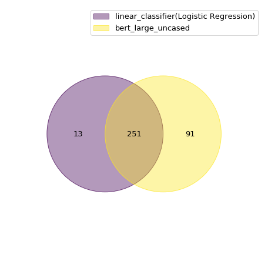

# story-cloze-test

# PART 1:

## 1.1 Description of our system:

In this part of the project we used Logistic Regression as our feature-based classifier to predict the correct ending to a four sentence story. To describe the implementation at a very high level, we first concatenated each ending with the four sentence story separately and created a feature vector using three linguistic features: n-grams, sentiment and cosine similarity. We then passed this vector along-with the true labels during the training phase into our feature based classifier(Logistic Regression). During the validation phase, we carry out the same feature extraction and pass it to our trained classifier. Since we have two rows corresponding to the two different endings of a single task, we select the ending with a higher probability of predicting label=1.  Also, we analyzed the results during the validation phase by changing parameters like the range of n-grams, internal parameters of the classifiers and also we analyzed different ways of converting the text to vector like averaging word-embeddings of glove vs using n-gram representation. We also analyzed different feature based classifiers like Multinomial Naive Bayes, Logistic Regression, SVM, XGBoost and did a comparative analysis of the results using accuracy as our main performance metric. In the test phase, we carry out steps similar to the validation phase, except the fact that we don’t have access to the true labels. We saved our predictions in a csv file and got an accuracy equal to 70.978%(on the test set).

This is a high level description of our system. We will describe every part in detail in the following section. 

1.1.1 Data pre-processing

We first create a list of all the words present in the training corpus. We then create a dictionary to store the unigrams with the corresponding count. To consider the unknown word handling, we create a list of words that we need to convert into ‘unk’ token based on the count of occurence in the training corpus(count=1 in our case). We then concatenate each ending to the four-sentence text and add it to a list which we pass it later to the CountVectorizer to get a vector corresponding to the text. Since there are 1497 training samples, this list has a size of 2994 since for each training sample we create a separate entry by concatenating with each of the possible endings. 

1.1.2 Feature engineering

We have considered n-gram representation of the four sentence text concatenated with one of the endings. We then tuned the parameter corresponding to the range of n-grams which is used in the CountVectorizer and found that the range (1,4) performs the best. We also used the difference of sentiment polarity of the four sentences and the ending text as a feature. In order to calculate this polarity, we have utilized the module from SentimentIntensityAnalyzer (compound score). Another feature we have considered is the similarity measure. We have used cosine similarity as our similarity measure. For calculating the score, we use the vector corresponding to the four sentences and the ending which we get from averaging the pre-trained glove embedding for all the words in the text. The value of this score determines the similarity between the two vectors(higher the score, higher is the similarity between the two vectors).

1.1.3 Training phase

After the feature extraction, we pass in the input features and the true labels to the model. Here, we also analyzed different machine learning models like Logistic Regression, Gradient Boosting, Multinomial NB,etc and found that Logistic Regression performed the best.

1.1.4 Validation phase
 
During the validation phase we do the same feature extraction as we do before during the training phase, and predict the output from our trained model. Since there are two outputs corresponding to one example, we take the prediction to be the one with a higher probability of being 1. We then check our accuracy based on our predictions and the true labels.

1.1.5 Test phase

The test phase is similar to the validation phase, only the difference being that we do not know the true labels. We thus save our predictions in a csv file as per the format specified in Kaggle and uploaded our results.

## 1.2 Justification of feature selection:

In this section, we will justify the selection of the three important features we have considered: sentiment, similarity measure and n-gram representation of text. 

1) N-gram representation of text:

In order to feed in the input to the classifier, we need to convert the text into some numerical representation. We started off with using the pre-trained Glove embedding vector corresponding to a word and then averaging it for the entire text. This didn’t yield good results and we feel this might be because taking an average of the entire text is not a very good representation of the entire text. We then switched to n-gram representation(including n-grams in the range 1 to 5) of the text using CountVectorizer. Changing the method of text representation did boost up our accuracy by around 8% on the validation set. We feel that n-gram representation gives better results since it preserves the information about the sequence of words in the corpus. 

2) Sentiment:

We have considered the difference of the sentiment polarities between the four sentence text and one ending. The motivation behind selecting sentiment as a feature was the intuition that the difference between the sentiment polarities of four sentence text and the correct ending would be in many cases lesser than that of the four sentence text and the wrong ending. In other words the sentiment of 4 sentences and the correct ending is similar compared to the wrong ending.

3) Similarity measure:

We have taken the cosine  similarity as the similarity measure between the four sentence vector and the ending vector. Our justification behind selecting this feature was the observation that in many cases, two vectors corresponding to the four sentence vector and correct ending would have a greater cosine similarity value compared to four sentence vector and wrong ending. Moreover, we did think of considering euclidean distance as a similarity measure but later switched to cosine similarity since it does even take into account the orientation of the vector which is really important.

## 1.3 Detailed illustration of extracted features for a training example:

Example considered:
4 sentences: Tim wanted to travel overseas. He had never been on an airplane before. He decided to travel to China by air. He actually enjoyed the flight!
Incorrect fifth sentence: Tim vowed never to get on another plane again.
Correct fifth sentence: Tim started traveling a lot of places by airplane.

1.3.1 Linguistic Feature 1: (Creating n-gram feature vector)

We have the feature vector of dimensions 156388, which we obtained from range of n-grams (1 to 4). We have combined 4 sentences + Incorrect fifth sentence, then updated the 156388 columns based on the count of the n-grams in this document and labeled this 0. Similar task is performed with  4 sentences + Correct fifth sentence, and labeled this row as 1. 

1.3.2 Linguistic Feature 2: (Finding sentiment)
We have measured sentiment polarity by using “sentiment intensity analyzer” using the compound attribute. We found the difference of the sentiment score of 4 sentences  and the Incorrect fifth sentence and found out the value to be -0.317. Similarly we find the difference of the sentiment score of 4 sentences and the correct fifth sentence and found out to be 0.

1.3.3 Linguistic Feature 3: (Similarity Score)
We have first encoded all the words in 4 sentences to word embeddings using “Glove 100 dimensions” pretrained model. Then we measure the average embedding by adding the all the word vectors and dividing it by number of words. Similarly we have found out the average for Incorrect fifth sentence and the correct fifth sentence. Then we have found the cosine distance between 4 sentences and Incorrect fifth sentence is measured and found out to be 0.9998531, this is labeled as 0, and cosine similarity of 4 sentences and Correct fifth sentence is measured and found out to be 0.9998544, this is labeled as 1. 

## 1.4 Implementation of three or more valid linguistic features:

1.4.1 N-grams:

We have first created a dictionary of unique words from the corpus as keys and corresponding counts as values. Then we replaced all the keys to “UNK” for which the value is 1. The corpus is also replaced accordingly with “UNK” words. For generating the feature vector, we used the countvectorizer function and generated n-grams for n=1 to 4, the range which we got after experimenting as shown in section 1.5.1. From this feature vector we have trained the classifier using Logistic Regression which was the best performing model compared to XGBoost, Gaussian Naive Bayes, Gradient Boosting and SVC.

1.4.2 Sentiment:

We considered sentiment as one of the linguistic features. We have imported the module “sentiment intensity analyzer”. This measures the sentiment of a document and gives 4 output labels corresponding to negative, neutral, positive and compound score. In our implementation, we have considered the compound score which has a range from -1 to 1. We have measured the sentiment of the first 4 sentences, and  the correct fifth sentence and the incorrect fifth sentence. The difference between the sentiment score of the first four sentences and the correct fifth sentence is measured and similarly the difference of sentiment scores of first four sentences and the incorrect fifth sentence is measured. This sentiment score is added to our feature set, along with the above mentioned N-grams features (generated in 1.4.1), thus increasing the existing dimension by 1.

1.4.3 Similarity measure:

Using “Glove” 100 dimensions, we found the embeddings of all the individual words in the corpus. We then found the average of the first four sentences embeddings and also found the average for correct and incorrect fifth sentence embeddings. We took the average embedding of the text since it would give a good representation of it. Then we find the cosine similarity between the 4 sentence embedding and correct fifth sentence embedding and  also find the cosine similarity between the 4 sentences embedding  and incorrect fifth sentence embedding. This similarity score is added to our feature set along with the above mentioned N-grams features, thus increasing the existing dimension by 1.

After incorporating all the linguistic features, a classifier is trained on this data. While predicting the labels, we have calculated the probabilities of 0 and 1 labels and assigned the label such that, only one of the two endings is selected based on which ending(with respect to the same four sentence text) has a greater probability of being 1. For our test set prediction, we are looking into pairs of documents, and seeing if the classifier labeled it differently. If it has, we leave it at that, if not we see the posterior probabilities of the classified label and reverse the label of the lower assigned probability. 

## 1.5 Quantitative and Qualitative analysis:

1.5.1 Quantitative analysis:
We first did an analysis for selecting the range of n-grams to be considered. The comparative analysis is shown in a tabular format on side:

We see that n=4 performs the best with an accuracy of 70.32, thus the further evaluation is done keeping this configuration.

We then performed a comparative analysis, with different combinations of the linguistic features that we have considered: n-grams, sentiment and similarity.
Table1.5.1: Accuracy for various n-gram sizes

N-grams (n=4)	Sentiment	Similarity	Accuracy
True	False	False	70.32
True	True	False	69.52
True	False	True	70.59
False	True	True	58.56
False	True	False	57.21
False	False	True	53.2
True	True	True	69.52
Table1.5.2: Accuracy for various combinations of linguistic features

From the above table, we can see that keeping n-grams and similarity as the features gives us the best result of 70.59 on the validation set. Coming to the feature importance, n-grams is the most important feature as removing this feature drastically decreases the accuracy of the model as we can see in the table above. The second most important feature is the similarity measure, since we can see a marginal increase in the accuracy when we add this feature. Also, we observed that including the difference of the sentiment of four-sentence text and the ending is the least important feature since in many cases, it decreases our accuracy as we can see in the table above. We think that the reason might be because the sentiment polarity score is not very accurate due to the smaller sentence length in our dataset.

Apart from the above analysis, we also performed a quantitative analysis across different machine learning models like Logistic Regression, XGBoost, Gaussian Naive Bayes, Gradient Boosting and SVC by considering all the features(n-grams+sentiment+similarity). We found out Logistic Regression performed the best, so all the above results are by using this model.

1.5.2 Qualitative analysis:
For qualitative analysis we took the best and second best performing features to see how it performed on particular examples. 
Best_performing_mode(Model 1) :  n_gram(n=4) + Similarity 
Second_best_performing_model(Model 2) : n_gram(n=4) only.

Example: “My niece applied for a job at the RMV two Year's ago.....She showed her employer a doctor's note showing she could not drive. They decided it was ok to let her work as a secretary.”

This is an example where Model 1 predicted correctly, but Model 2 model did not. 
Reason: There is a presence of similar words in the four sentence text and the correct ending which is “they”, “was”, “work”, etc  due to which the average word embedding of the four sentence is more similar to the correct ending. Thus we think that here the similarity measure is also very important to predict the correct output along with n-grams and thus it predicted this example correctly. 

Example: “Gina was at her friend Ruth's house....So now she avoids Jane all the time.”

This is an example where Model 2 predicted correctly, but Model 1 model did not. 
Reason: Here there are some similar words in both the wrong and correct endings with respect to the four sentence text like “Jane”, “she”, etc. Thus the similarity measure is not a very helpful measure to include due to which it predicts it incorrectly when similarity is added as a feature alongwith n-grams.

For the future improvements, we plan to do a more exhaustive parameter tuning using GridSearchCV for the models that we have experimented with.

# PART 2:

## 2.1 Implementation
In this part of the project we used BERT as our pre-trained engine. We imported pretrained bert-base and bert-large from transformers package the one used in Huggingface Github repository. To describe the implementation at a very high level, we took a pretrained bert model and updated its weight from the pretrained state using the training set of our downstream classification task. BERT pretrained comes with cased and uncased option which we explored for the purpose of accuracy comparison as well. We also compared between bert-base and bert-large and reported the difference in accuracy from both models.

BERT models are very sensitive to overfitting and from different literatures it is widely accepted to keep the epochs to a range of 2-4. We settled with 3 epochs as it gave us best results. For every epoch we trained the model using the entire training corpus feeding it at batches of specific batch sizes. We explored different batch_sizes and found drastic result variations reflecting  that BERT is very sensitive to batch_size as well. Consequently, after training through the entire corpus, we validate our model on the validation set (which is rather small compared to the training set). We keep a track of the validation accuracy (and/or validation loss) and save the model weights corresponding to best validation accuracy and/or least validation loss. After completion of 3 epochs, we load the best model weights and run the best_model on the test set to get the labels for the test set.  

This is a high level description of our implementation and the general structure of our code. We will describe every part in detail in the following section. 

2.1.1 Data Processing with Special Tokens ([CLS] and [SEP])
Data processing is of paramount importance when using BERT since it takes documents in a very specific format. The reason BERT has a stringent input format is because it is designed for a wide range of applicabilities catering to various NLP tasks such as sentiment analysis, machine translation, question answering, common-sense detection etc. 

In our case, we arranged each document (concatenation of first four sentences) by concatenating it with the first and second ending separately. Therefore each document is transformed into two documents, (doc + ending_1) and (doc + ending_2). We do this task using the fetch_data() function in our code. 

Following the BERT paper1 , we started every document with [CLS] token and then added the four sentences of the document. We used [SEP] token before concatenating the respective endings and then used another [SEP] after the ending. This is to separate the two sentences in a sequence. Sentence in this case doesn’t refer to a linguistic sentence, but can be a collection of any linguistic sentences. In our case, it is 4. The second sentence in our case is one of the endings. The entire thing is called a sequence  as per the paper’s1  terminology. 

fetch_data() function returns a list with double the size of training/validation/test data.

2.1.2 Convert Words to Token IDs
Pretrained BERT comes with pre-trained weights and word embeddings. Each word needs to be mapped to a certain ID which in turn corresponds to an embedding (usually of 1024 dimensions). An inbuilt command encode_plus() handles this operation for us seamlessly. BERT very intelligently handles out of vocabulary (OOV) words by breaking down any OOV word into sub words which are present in the vocabulary of BERT. Again, this is done internally.

2.1.3 Assigning Segment IDs
Segment IDs are generally done to indicate/identify two sentences in a sequence. If the sequence has just one sentence, then the ids are typically ZERO. Otherwise, the second sentence is generally identified as a series of 1’s.

2.1.4 Padding
Each sequence generally represents a document in the dataset. Hence, their lengths vary by quite a bit. However, as an input to BERT, we need fixed length sequences. Hence, we added trailing zeros to the right hand side of the sequence to make it upto a fixed length. We played around with different lengths and fixed it as 80 since it was giving the best result.

2.1.5 Masking
Masking is done as a consequence of padding to identify the actual sequence from the padded zeros. There, a typical masking would put a series of 1’s against every real word of a sequence and then put 0’s for the rest of the padded sequences. It helps the algorithm internally to put more importance on the actual sentence. 

## 2.2 Learning Curve
The learning curve for the best system is shown below.

We ran the model for three epochs as we found that 4 epochs is overfitting the model to the training set. We see that the training loss is reducing progressively and has almost plateaued from second to third epoch compared to the drop between first and second epoch. 
The validation acc is not changing because we suspect that the validation set is just comprised of 374 examples, which is too small to bring about any significant variation. 

## 2.3 Quantitative and Qualitative Analysis

2.3.1 Quantitative Analysis
We have used the following 4 different types of our model choices for our Quantitative analysis.
S.No	Model Choice	Number of correctly predicted on Dev set	Accuracy on Dev
1	bert_large_cased	333	89.04%
2	bert_large_uncased	342	91.44%
3	bert_base_cased	284	75.94%
4	bert_base_uncased	312	83.42%
Table 2.3.1 Accuracy scores of various model choices

Following data represents a venn diagram of intersections of correctly predicted labels for the above mentioned model choices. 

Fig2.3.1: Venn diagram comparison of correctly predicted documents for different model choices

Within BERT Model Comparison:

Our best performing model on Validation and test set is Bert_large_uncased which requires the entire corpus to be lower-cased before adding special tokens. We do a comparative study of our accuracy results as a part of our quantitative analysis. 
BERT_large_uncased predicted 342 documents correctly. (Best performing model)
BERT_large_cased predicted 333 documents correctly, out of which 316 documents were correctly predicted by both the models. So BERT_large_cased predicted 92% of the correct labels  predicted by BERT_large_uncased. 
BERT_base_uncased predicted 312 labels correctly. BERT_base_cased predicted 284 labels correctly out of which 303 labels were correctly predicted by both the models. Therefore, BERT_base_cased predicted 97% of the labels predicted by BERT_base_uncased. 
In both the situations we can say that uncased (lowercasing) works better than cased. If we compare uncased bert_large and uncased bert_base, we see that bert_base predicts 72% of the labels predicted by bert_large. This is expected as BERT_large has weights and hidden layers compared to BERT_base. 

Comparing between best performing Linear Classifier and best performing BERT model:

From the figure below we can see that the linear classifier is predicting 73% of the correct labels predicted by the BERT model. The rest of the venn diagram is self explanatory.

                        Fig 2.3.2: Venn diagram comparison of correctly predicted documents for part-1 and part-2

2.3.2 Qualitative Analysis  
In this section, we take examples to show why certain models are predicting them correctly and why certain models are not. We do this comparing different BERT models and then comparing BERT with the linear classifier we trained in part 1. 

Within BERT Comparison:
Comparison between bert_large_uncased and bert_base_uncased.
Example: “Sarah went with her friends to the water park…..They went back the next day.”
(bert_large_uncased got this correct,  bert_base_uncased got this incorrect)
Reason: In this example, the first 4 sentences have positive sentiment, the first ending has negative sentiment and the second ending has positive sentiment. BERT_base is not able to capture this sentiment alteration as only one sentence has negative sentiment out of 5 sentences. BERT large, being a bigger model is able to capture this subtle change.
Example: “My friend went out one night looking to find love…...Our friend ended up home at three am with a girl.”
(bert_large_uncased got this incorrect,  bert_base_uncased got this correct)
Reason: While we reasoned out that sentiment prediction is hard for a smaller model, in this situation, the contextual embedding of skiing is far away from the rest of the sentence. Hence, it becomes easier for BERT_base to get this correct. BERT_large may have overfitted on the training data in this case.

Comparison Between Linear Classifier and BERT Model:
Example: “The teacher announced that there would be a pop quiz…...The students cheered because they were free.”
(Linear Classifier got this correct, but BERT did not)
Reason: We used cosine similarity as one of our features for the linear classifier. This example stands out prominently as cosine similarity scores between the first ending and second ending should be very different as both the endings have very different sense. BERT probably did not classify this properly because BERT breaks many words up into subwords and hence may lose contextual meanings.

Example: “Fred liked mystery novels…...Fred told his friends he was taking a break from mystery novels.”
(Linear Classifier got this incorrect, but BERT got this correct)
Reason: This is an inference based decision making. That is the many words in the 5th sentence are dependent on the first and second sentences. Through attention heads, BERT is better able to capture this compared to n-grams feature of linear classifier. Hence, BERT classifies this correctly.

